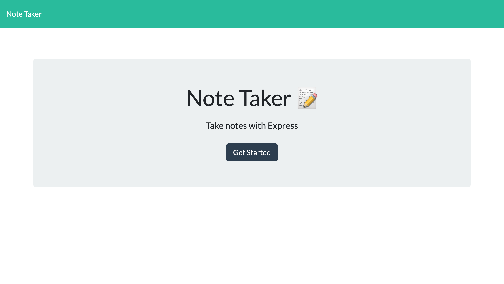
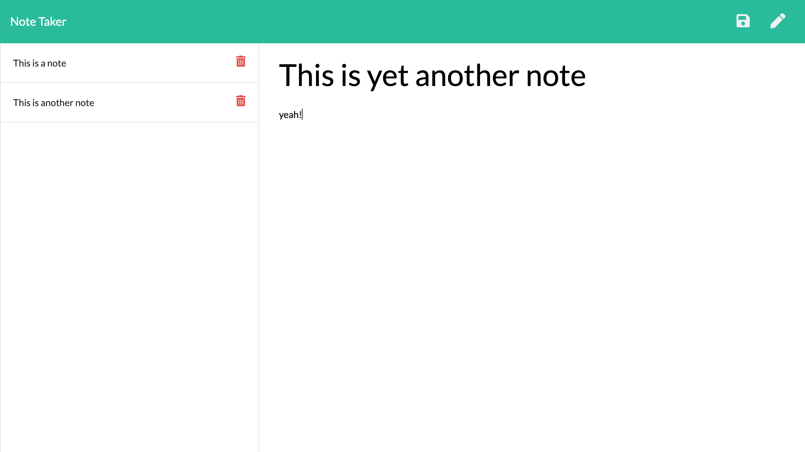

# Notetaker 

Allows users to write, save, and retrieve notes.

## Table of Contents
1. [ How to Get to It ](#Install)
1. [ Usage ](#Usage)
1. [ Visuals ](#Visuals)
1. [ Features ](#Properties)
1. [ Link to Repository ](#Link)
1. [ Deployed Website ](#Site)
1. [ Next Steps ](#Next)
1. [ Authors and Acknowledgement ](#Authors)
1. [ Questions ](#Questions)
1. [ License ](#License)

## 1. How to Get to It

Just go to https://tasha876-notetaker.herokuapp.com/ and start using.

## 2. Usage

Click on the notes pane to add a note. Click on the save button once you have entered a note to save it and retrieve a note by clicking the title on the left panel. click on the pen icon to get to a new note pane to add another note.

## 3 Visuals
### Pictures of the site
#### Splash page

#### Main page

### Demo video
[ Download demo video here! ](https://drive.google.com/file/d/1hKW1kwrKFErjRBulUkfOqPXXwFvXeUWe/view?usp=sharing)

## 4. Features 

* Allows users to write notes.
* Allows users to save notes.
* Allows users to retrieve saved notes.
* Allows users to delete saved notes.
* Uses JSON to store user entered data.

## 5. Link to the Repository 

Link to the [GitHub repository](https://github.com/Tasha876/Notetaker).

## 6. Deployed Website 

[The deployed site](https://tasha876-notetaker.herokuapp.com/), hosted by GitHub Pages.

## 7. Next Steps
* Definitely add functionality to allow users to modify saved notes.
* Improve UI and UI colour-palette.

## 8. Authors and Acknowledgement 

This project was created entirely by [Tasha876](https://github.com/Tasha876).

## 9. Issues 

Please direct all issues [here](https://github.com/Tasha876/Notetaker/issues).

## 10. License 

This project is covered by the [MIT](License) license.